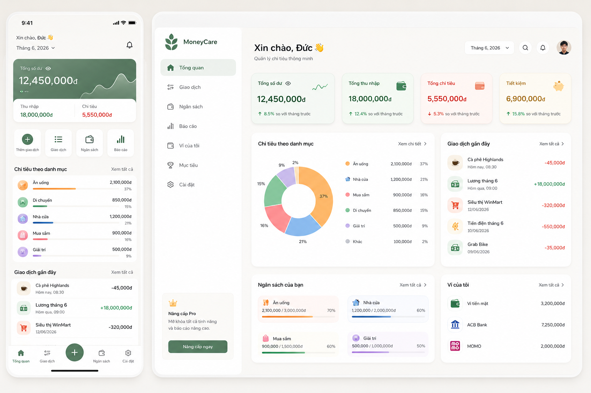
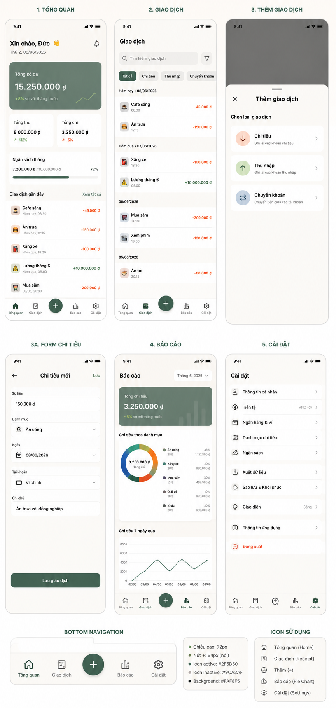
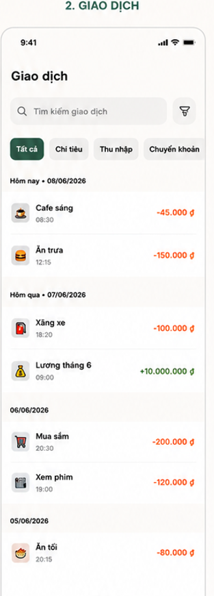
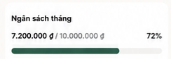
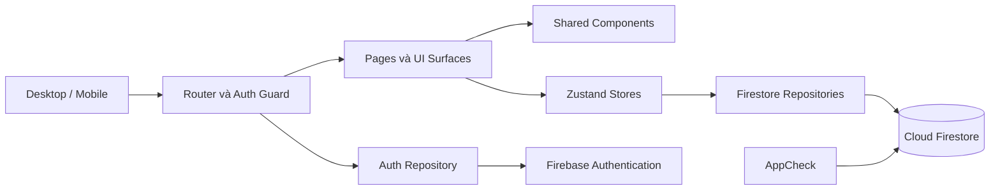

<p align="center">
  
</p>

<h1 align="center">MoneyCare</h1>

<p align="center">
  Ứng dụng quản lý tài chính cá nhân giúp theo dõi ví, giao dịch, ngân sách và dòng tiền trên cả desktop lẫn mobile.
</p>

## Tổng quan

MoneyCare tập trung các hoạt động tài chính hằng ngày vào một nơi: ghi nhận thu chi, quản lý nhiều loại ví, kiểm soát ngân sách theo danh mục và theo dõi xu hướng qua biểu đồ. Mỗi tài khoản có vùng dữ liệu riêng trên Firebase và có thể cá nhân hóa giao diện theo nhu cầu sử dụng.

<p align="center">
  
</p>

<p align="center">
  
  &nbsp;&nbsp;
  
  &nbsp;&nbsp;
  
</p>

## Tính năng nổi bật

### Đăng nhập và thiết lập ban đầu

- Đăng ký, đăng nhập bằng email/mật khẩu hoặc Google.
- Tự động tách dữ liệu theo tài khoản người dùng.
- Yêu cầu tạo ví đầu tiên với số dư ban đầu lớn hơn `0` khi tài khoản chưa có ví.
- Đồng bộ tên hiển thị giữa Firebase Authentication và hồ sơ Firestore.

### Giao dịch và ví

- Tạo, sửa và hủy giao dịch thu, chi hoặc chuyển khoản.
- Thanh toán dư nợ thẻ tín dụng bằng giao dịch chuyên biệt.
- Quản lý ví tiền mặt, ví điện tử, tài khoản ngân hàng, tiết kiệm và thẻ tín dụng.
- Chọn ví mặc định, thay đổi thứ tự và ẩn các ví ít sử dụng.
- Điều chỉnh số dư bằng lịch sử giao dịch để dữ liệu tài chính có thể truy vết.
- Lọc, sắp xếp và xem giao dịch theo từng khoảng thời gian.

### Ngân sách và danh mục

- Thiết lập ngân sách cho từng danh mục theo tháng.
- Theo dõi số đã chi, số còn lại và trạng thái cảnh báo hoặc vượt ngân sách.
- Xem tỷ trọng chi tiêu bằng donut chart và mở danh sách giao dịch của từng danh mục.
- Sắp xếp, ẩn/hiện và chọn danh mục mặc định.

### Dashboard và báo cáo

- Tổng hợp số dư, thu nhập, chi tiêu và dòng tiền.
- Theo dõi xu hướng thu chi theo tháng và chi tiêu theo tuần.
- Hiển thị lịch chi tiêu theo ngày, phân bổ theo danh mục và các giao dịch lớn.
- So sánh chi tiêu với kỳ trước, phân tích ví và dự báo chi tiêu.
- Giao diện responsive riêng cho desktop và mobile, dùng chung dữ liệu và nghiệp vụ.

### Cá nhân hóa và dữ liệu

- Chọn giao diện sáng/tối theo theme của ứng dụng.
- Chọn bộ biểu tượng `Base` tối giản hoặc `Emoji`; lựa chọn được đồng bộ trên các màn hình.
- Chọn tiền tệ `VND`/`USD`, định dạng số tiền và định dạng ngày.
- Ẩn số dư khi cần riêng tư.
- Xuất giao dịch ra CSV tương thích Microsoft Excel và tiếng Việt.

## Công nghệ

| Nhóm | Công nghệ |
| --- | --- |
| Giao diện | React 19, React Router 7, Sass |
| Build tool | Vite 8 |
| State management | Zustand 5 |
| Biểu đồ | Recharts 3 |
| Backend | Firebase Authentication, Cloud Firestore, App Check |
| Kiểm tra mã nguồn | ESLint 10 |

## Kiến trúc tổng quan



- `Page` điều phối route, dữ liệu và trạng thái màn hình.
- `Surface` tổ chức giao diện theo desktop hoặc mobile.
- Component dùng chung giữ hành vi và cách hiển thị nhất quán giữa các thiết bị.
- Repository chịu trách nhiệm tạo Firestore path, kiểm tra dữ liệu và thực hiện mutation.
- `transactions` là nguồn dữ liệu gốc; số dư ví và thống kê tháng là các projection phục vụ truy vấn nhanh.

## Cấu trúc dự án

```text
src/
├── components/brand/              Logo và nhận diện MoneyCare
├── lib/firebase/                  Firebase app, auth, firestore và App Check
├── modules/auth/                  Đăng nhập, đăng ký và hồ sơ người dùng
├── modules/expenses/
│   ├── api/                       Firestore repositories và schema
│   ├── components/
│   │   ├── desktop/               UI dành cho desktop
│   │   ├── mobile/                UI dành cho mobile
│   │   ├── shared/                Component dùng chung
│   │   └── ...                    Component theo nghiệp vụ
│   ├── constants/                 Metadata và cấu hình UI dùng chung
│   ├── hooks/                     Bootstrap và đồng bộ dữ liệu
│   ├── icon/                      Bộ icon Base và Emoji
│   ├── pages/                     Các trang theo route
│   ├── styles/expenses/           Sass theo màn hình và component
│   └── utils/                     Tính toán, định dạng và xuất CSV
├── routes/                        App routes và auth guard
└── stores/                        Zustand stores
```

## Điều hướng

| Route | Màn hình |
| --- | --- |
| `/expenses/dashboard` | Tổng quan |
| `/expenses/transactions` | Giao dịch |
| `/expenses/category-spending` | Chi tiêu theo danh mục |
| `/expenses/report` | Báo cáo |
| `/expenses/budgets` | Ngân sách |
| `/expenses/wallets` | Ví tiền |
| `/expenses/settings` | Cài đặt |

## Mô hình dữ liệu

Dữ liệu của mỗi người dùng nằm dưới `users/{uid}`:

```text
users/{uid}
├── displayName, email, photoURL, timestamps
└── modules/expenses/
    ├── settings/main
    ├── wallets/{walletId}
    ├── categories/{categoryId}
    ├── transactions/{transactionId}
    ├── budgets/{budgetId}
    └── monthlyStats/{monthKey}
```

Firestore Security Rules giới hạn người dùng chỉ được truy cập dữ liệu thuộc tài khoản của mình, đồng thời kiểm tra schema và các bất biến tài chính trước khi chấp nhận ghi dữ liệu.

## Chạy dự án trên máy local

### Yêu cầu

- Node.js phù hợp với Vite 8.
- Một Firebase project đã bật Authentication, Cloud Firestore và App Check.

### 1. Cài dependency

```bash
npm install
```

### 2. Khai báo biến môi trường

Tạo file `.env.local` tại thư mục gốc:

```env
VITE_FIREBASE_API_KEY=<firebase-api-key>
VITE_FIREBASE_AUTH_DOMAIN=<firebase-auth-domain>
VITE_FIREBASE_PROJECT_ID=<firebase-project-id>
VITE_FIREBASE_STORAGE_BUCKET=<firebase-storage-bucket>
VITE_FIREBASE_MESSAGING_SENDER_ID=<firebase-messaging-sender-id>
VITE_FIREBASE_APP_ID=<firebase-app-id>
VITE_RECAPTCHA_V3_SITE_KEY=<recaptcha-v3-site-key>
```

Đây là cấu hình public của Firebase Web SDK. Không đưa reCAPTCHA secret key hoặc thông tin quản trị Firebase vào source code.

### 3. Khởi chạy

```bash
npm run dev
```

Mở `http://localhost:5173`. Để truy cập từ thiết bị khác trong cùng mạng LAN:

```bash
npm run dev:lan
```

Trên Windows, nếu PowerShell chặn các file `.ps1`, có thể dùng `npm.cmd` và `npx.cmd` thay cho `npm` và `npx`.

## Kiểm tra chất lượng

```bash
npm run lint
npm run build
npm run preview
```

## Cấu hình và deploy Firestore

Deploy Security Rules:

```bash
npx firebase-tools deploy --only firestore:rules
```

Deploy đồng thời Rules và Indexes:

```bash
npx firebase-tools deploy --only firestore
```

Hãy kiểm tra đúng Firebase project trước khi deploy. Thay đổi trong file rules ở local không tự động có hiệu lực trên môi trường Firebase đang chạy.

## Tài liệu kỹ thuật

- [`src/modules/expenses/README.md`](./src/modules/expenses/README.md): mô hình dữ liệu và quy tắc nghiệp vụ của module Expenses.
- [`FIREBASE_FIRESTORE_SETUP.md`](./FIREBASE_FIRESTORE_SETUP.md): cấu hình Firebase CLI, Firestore Rules và Indexes.
- [`SECURITY.md`](./SECURITY.md): Authentication, App Check và checklist bảo mật.

---

MoneyCare đang được phát triển theo hướng một ứng dụng tài chính cá nhân gọn gàng, dễ sử dụng và nhất quán trên mọi kích thước màn hình.
